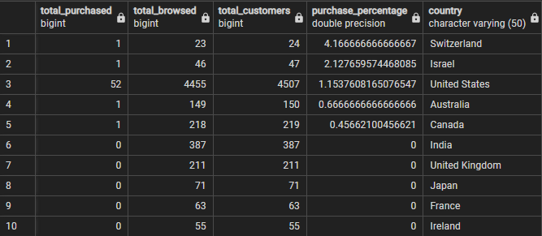
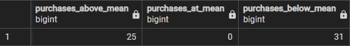
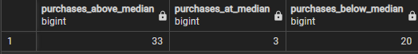

**Question 1: What perentage of customers browse vs making a purchase, per country?**

*SQL Queries:*

```sql
SELECT 
--	counting amount of customer purchases against amount where no purchase was made
	COUNT (loc.country) FILTER (WHERE clean.totaltransactionrevenue >0) AS total_purchased,
	COUNT (loc.country) FILTER (WHERE clean.totaltransactionrevenue <1) AS total_browsed,
	COUNT(loc.country) as total_customers,
--	dividing the amount of purchases against the total amount of visitors
	ROUND(
	COUNT (*) FILTER (WHERE clean.totaltransactionrevenue >0)*100) --AS total_purchased,
	/ COUNT(*) AS purchase_percentage,
	loc.country
FROM cleaned_all_sessions clean
JOIN cleaned_location loc USING (primary_key)
GROUP BY 
	loc.country
ORDER BY 
	purchase_percentage DESC,
	total_customers DESC,
	COUNTRY ASC
```


Answer:

Switzerland is most likely to make a purchase overall, although Americans make the most amount of purchases. 




**Question 2: Do product restock times make a difference on revenue?**


*SQL Queries:*

```sql
SELECT
	COUNT (*) FILTER (WHERE	prod.restockingleadtime <12 -- COUNT OF ITEMS BELOW MEDIAN
					 )	AS	orders_below_median,
	COUNT (*) FILTER (WHERE	prod.restockingleadtime =12 -- COUNT OF ITEMS AT MEDIAN
					 )	AS	orders_at_median,
	COUNT (*) FILTER (WHERE	prod.restockingleadtime >12 -- COUNT OF ITMES ABOVE MEDIAN
					 )	AS	orders_above_median,
	COUNT(clean.totaltransactionrevenue) AS total_purchases
FROM 
	products prod
JOIN
	cleaned_all_sessions clean
ON	prod.sku = clean.productsku
WHERE clean.totaltransactionrevenue >0
AND prod.restockingleadtime <=19
```

*Answer:*

Items with lower restock times appear to be more likely to sell.


**Question 3: What prices are people more likely to make purchases at?**


*SQL Queries:*

```sql
--	Seeing how many people make purchases based on the mean of $33
--	25 purchases above products priced $33, and 31 below (none where item was 33)

SELECT 
	COUNT (totaltransactionrevenue) FILTER (WHERE productprice >33) AS purchases_above_mean,
	COUNT (totaltransactionrevenue) FILTER (WHERE productprice =33) AS purchases_at_mean,
	COUNT (totaltransactionrevenue) FILTER (WHERE productprice <33) AS purchases_below_mean
FROM 
	cleaned_all_sessions
WHERE
	productprice !=0
AND
	totaltransactionrevenue !=0
```


```sql
SELECT 
	COUNT (totaltransactionrevenue) FILTER (WHERE productprice >18.99) AS purchases_above_mean,
	COUNT (totaltransactionrevenue) FILTER (WHERE productprice =18.99) AS purchases_at_mean,
	COUNT (totaltransactionrevenue) FILTER (WHERE productprice <18.99) AS purchases_below_mean
FROM 
	cleaned_all_sessions
WHERE
	productprice !=0
AND
	totaltransactionrevenue !=0
```

*Answer:*

People are most likely to make purchases that are in between the mean price of $33 and the median of $18.99


